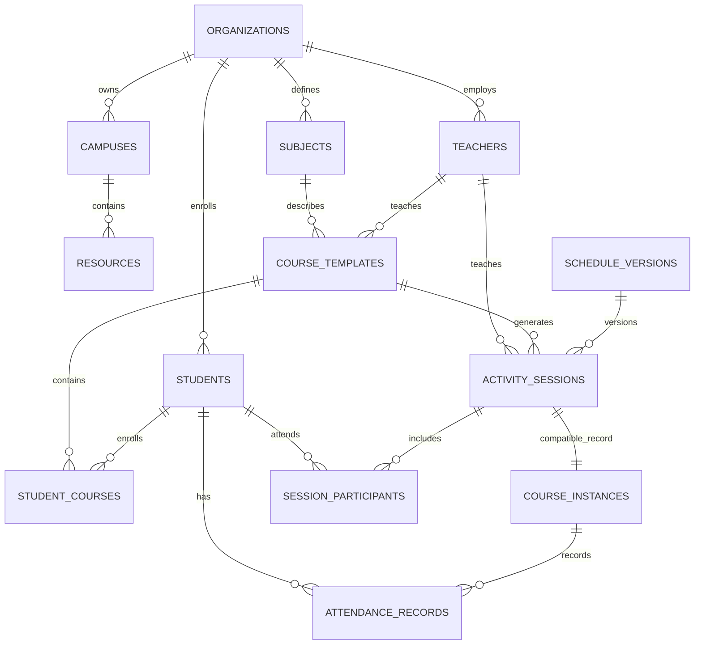

# SQLite 共享数据底座 v1

实现以 `sqlite-schema-preview.html` 的业务表为基础，并补充路线图第 1 阶段要求的组织、校区、资源、课表版本和活动会话边界。可执行迁移位于 `src/db/migrations.js`。

## 实体关系

## 表来源

| 表 | 来源与用途 |
|---|---|
| `grades`、`head_teachers`、`teachers`、`subjects`、`classes`、`students` | 预览文件中的基础资料表 |
| `time_periods`、`course_templates`、`student_courses` | 预览文件中的课程结构表 |
| `course_instances`、`attendance_records` | 预览文件中的业务记录表 |
| `organizations`、`campuses`、`resources` | 路线图要求的组织与共享资源边界 |
| `schedule_versions`、`activity_sessions`、`session_participants` | 草稿、发布、完成状态及参与者关系 |
| `recurrence_rules`、`exception_rules` | 现有 ERP 周期和调课异常的事务化存储 |
| `schema_migrations`、`app_metadata`、`app_snapshots` | 迁移版本、完成标记、内部数据快照与迁移前备份 |

所有组织业务表均包含 `organization_id`；主要实体包含 `created_at` 和 `updated_at`。外键默认启用，教师名称只保存在 `legacy_teacher_name` 兼容字段，课程关系使用稳定 `teacher_id`。

## 状态规则

`activity_sessions.status` 只允许 `DRAFT`、`PUBLISHED`、`COMPLETED`。合法转换为 `DRAFT -> PUBLISHED -> COMPLETED`；已完成会话禁止普通修改。教师查询 Repository 默认只返回 `PUBLISHED` 和 `COMPLETED`。

## 迁移与恢复

首次启动顺序：归档完整旧 JSON、开启事务、创建默认机构/校区/教师、写入实体和关系、执行数量与外键校验、写入 `migration_completed`。任一步失败会回滚转换事务并继续使用 localStorage；迁移前 JSON 归档不会被回滚。

完整备份使用 `.oragshedule-backup` 扩展名，内部由 Node SQLite backup API 生成，并包含 `app_snapshots` 中的内部迁移快照。恢复入口接受完整备份和 SQLite 文件；恢复前自动生成 `before-restore` 副本，并检查 `PRAGMA integrity_check` 与迁移版本。不提供 JSON 备份导入或导出。

内部快照同时保存 `timetableSettings`、`timetableGrades` 和 `timetableSalarySettings`。SQLite 是应用启动时的事实来源，localStorage 保留为现有教师界面的兼容缓存；每次业务或设置保存后都会同步新快照。
